# Online Booking System

Design an online booking system for hotels. The system should allow users to search for hotels, view hotel details, make bookings, and leave reviews. Hotel managers should be able to manage their hotel information, view bookings, and generate reports.

## Architecture Diagrams

The diagrams below were generated programmatically with the Python [`diagrams`](https://diagrams.mingrammer.com/) library (script: [`diagrams/generate.py`](./diagrams/generate.py)). They complement the Mermaid sequence/flow diagrams embedded later in this document.

### System Architecture Overview
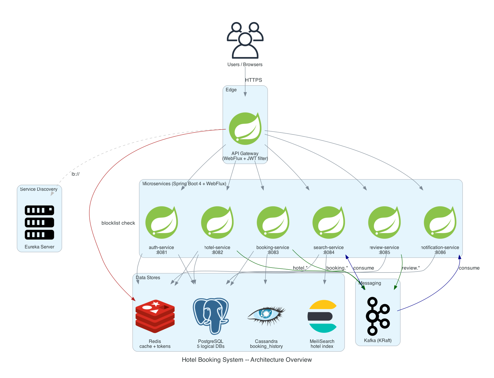

### Auth: Access + Refresh Token Lifecycle
Short-lived JWT access token (15 min) + opaque refresh token (7 days, stored in Redis). Logout blocklists the access-token `jti` in Redis (TTL = remaining lifetime) and deletes the refresh token. Refresh rotates the token (old one is `GETDEL`'d in one round trip, so a stolen refresh token can only be used once).

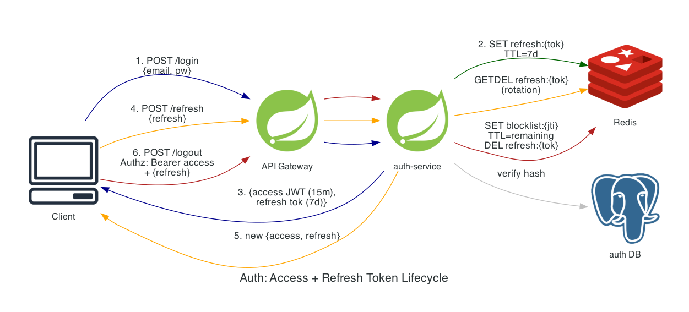

### Per-Request: Gateway Token Validation
Every protected request is HMAC-verified, then checked against the Redis blocklist before the gateway strips the `Authorization` header and forwards `X-User-Id` / `X-User-Role` to downstream services.

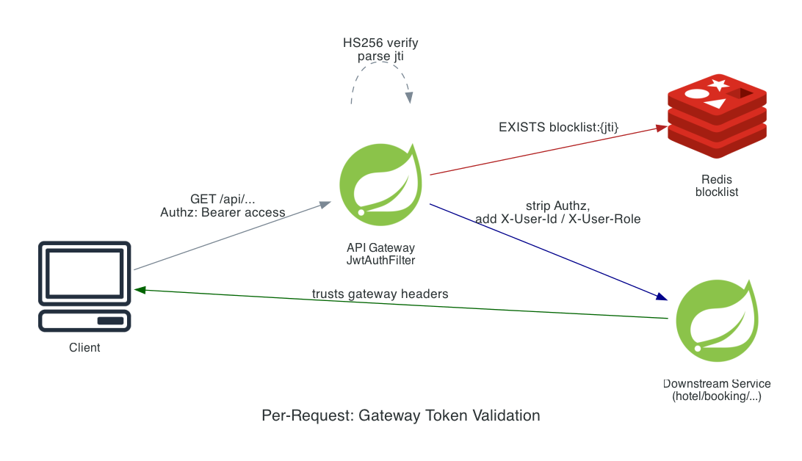

### Booking & Payment Flow
Synchronous availability decrement against hotel-service; async fan-out via Kafka after CONFIRMED. Append-only history is co-located per user in Cassandra.

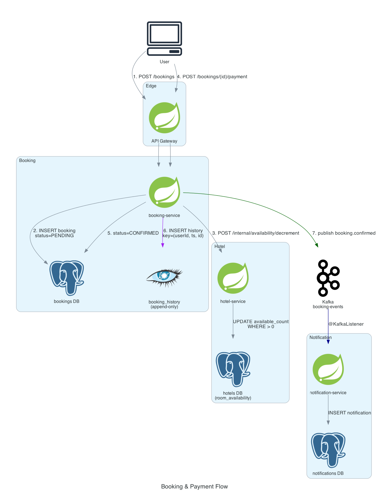

### Search Index Synchronization (CQRS Read Model)
`hotel-service` publishes domain events on every CRUD; `search-service` consumes them and projects into a denormalized MeiliSearch index. Redis caches search responses for 60s.

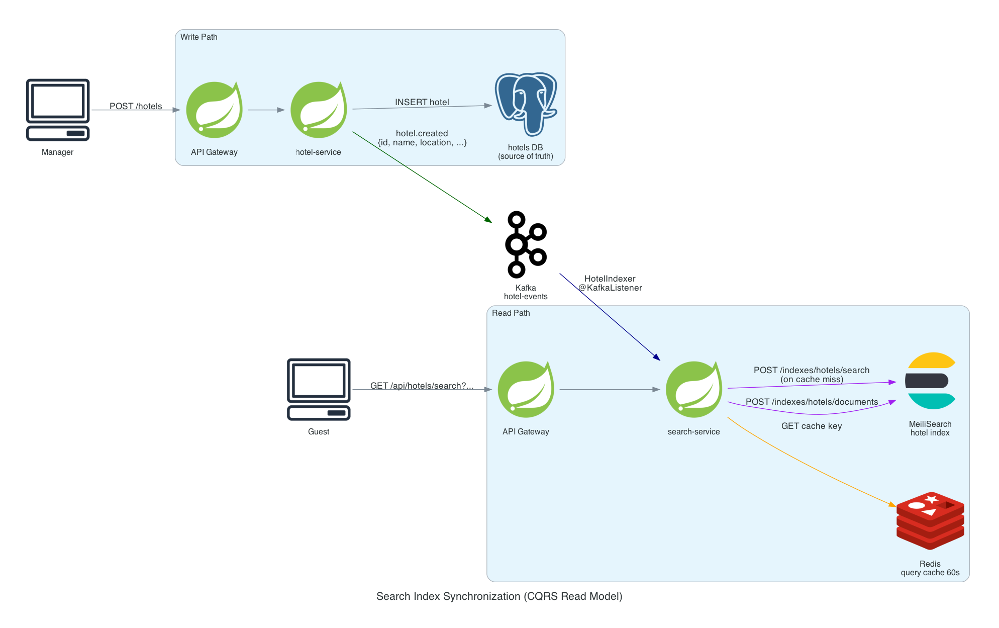

### Polyglot Persistence
Each microservice owns its store; storage choice follows the access pattern (Postgres for transactional, Cassandra for high-write append-only history, MeiliSearch for full-text, Redis for cache + token state).

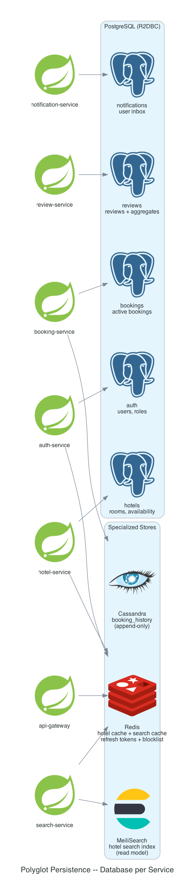

---

## 1. Overview and Questions to Clarify

1. How do users search for hotels? Are the filters predefined (e.g., location, price range, amenities) or can hotels be tagged with custom attributes?
2. Can users upload images in reviews?
3. Are all bookings prepaid, or is there an option for pay-at-hotel?
4. What is the expected traffic for the system (e.g., number of users, number of hotels)?
5. For each hotel, do we have a single hotel manager account, or can there be multiple managers for a hotel?
6. Are the prices for rooms fixed, or can they vary based on demand (dynamic pricing)?
7. Can we use a single currency (USD) for prices, or do we need to support multiple currencies based on hotel location?
8. What is the cancellation and refund policy? Can a `confirmed` booking be cancelled by the user, and within what window is a full vs. partial refund offered?
9. Are reviews moderated before they appear publicly, or do they go live immediately on submission?
10. Can users edit their reviews after submitting, or is delete-and-recreate the only path?
11. Should hotel managers be able to reply to reviews? If yes, is the reply public and is there a limit (one reply per review)?
12. Are check-in and check-out values strict times (e.g., 3pm / 11am) or just dates? Whose time zone applies — the hotel's local time or UTC?
13. Is overbooking allowed (selling more rooms than physical inventory to absorb cancellations)? If yes, what's the policy when an overbooked guest arrives and no room is available?
14. Should hotel managers be able to set blackout dates (e.g., maintenance, private events) that block bookings without changing inventory permanently?
15. What is the maximum booking lead time? (Can a user book a year out, only 90 days, etc.?)
16. Can users make group bookings (multiple rooms in one transaction)? Is partial confirmation allowed (some rooms confirm, others fail)?
17. What is the data retention policy for completed bookings, payment attempts, and reviews? (Required for storage sizing and any compliance.)

19. Geographic distribution: single region or multi-region? If multi-region, do we need active-active or is active-passive acceptable?
20. What's the search latency SLA at the p99 (e.g., < 200ms)? This drives whether we need a regional CDN, ES tier, and aggressive cache TTLs.
21. How are payment disputes and chargebacks handled? Does the Booking Service expose a webhook for the Payment Gateway to notify of disputes?
22. Authentication: is JWT alone sufficient, or do we need 2FA, social login (Google, Apple), or SSO for hotel managers?
23. Is there a notion of "favorite hotels" or "saved searches" for users? (Affects whether we need a User Profile service surface.)
24. What happens when a hotel is deleted or suspended — do existing bookings stand, are they auto-refunded, or moved to a different hotel?
25. Are room images mandatory at hotel registration, or can a hotel be listed without images?


## 2. Functional Requirements

### 2.1. Hotel Side

1. Hotel manager can create an account and login to the system. Each hotel can have only one hotel manager account**[5]**
2. Hotel manager can add, update, and delete hotel information, including room types, prices, and availability. Hotel information includes images for rooms.
3. Hotel manager can view and manage bookings, including confirming or canceling reservations.
4. Hotel manager can generate reports on bookings and revenue.
5. Hotel can have stars, location, type (hostel, motel, resort, etc.), and amenities (pool, gym, free wifi, etc.) to help users filter and choose hotels.
6. Price for rooms can vary based on demand (dynamic pricing), the system should allow hotel managers to set rules for dynamic pricing (e.g., increase price by 20% if occupancy is above 80%). The rules can be based on occupancy, seasonality (Start date and end date), or special events (e.g., holidays, local events)**[6]**.
7. For simplification, we will assume all bookings are prepaid and prices are in USD**[3][7]**.

### 2.2. User Side

1. User can create an account and login to the system.
2. User can search for hotels based on location, dates, price range, and room type.
3. User can view hotel details, including different room types, prices, and availability.
4. User can make a booking by selecting a hotel, room type, and providing necessary information. This includes entering personal details, payment information, and confirming the booking.
5. User can view and manage their bookings, including canceling reservations if needed.
6. User can leave reviews and ratings for hotels they have stayed at, which can help other users make informed decisions when choosing a hotel. Reviews can include text comments and images**[2]**.
7. User can receive notifications about their bookings, such as confirmation emails, reminders before check-in, and updates on any changes to their reservations.

## 3. Non-Functional Requirements

1. Low latency.
2. High availability.
3. Can scale to:
   - 1M hotels.
   - 100M users.

## 4. Constraints

1. Each hotel can have up to 1000 rooms.
2. Each user can have up to 10 active bookings at a time.
3. Upon registering a hotel, the system should verify the hotel's legitimacy through a third-party service. Hotel managers must provide valid business credentials, and the system will use an external API to confirm the authenticity of the hotel before allowing it to be listed on the platform.


## 5. Design Phases
### 5.1. Phase 1: Simple Scale Design
#### 5.1.1. Design Decisions
1. Use an SQL database (e.g., PostgreSQL) to store hotel and booking information, as it provides strong **consistency** and hotel data is relational in nature.
2. Implement a simple monololithic server that has all functionalities.
3. Deploy the server on multiple instances behind a load balancer to handle increased traffic.
4. Use Redis for caching frequently accessed data, such as hotel details and search results, to reduce latency.
5. Implement a simple authentication mechanism using JWT tokens for user and hotel manager authentication.
6. Use a third-party payment gateway to handle payment processing securely.
7. Implement basic monitoring and logging to track system performance and errors.

### 5.1.2. Diagram

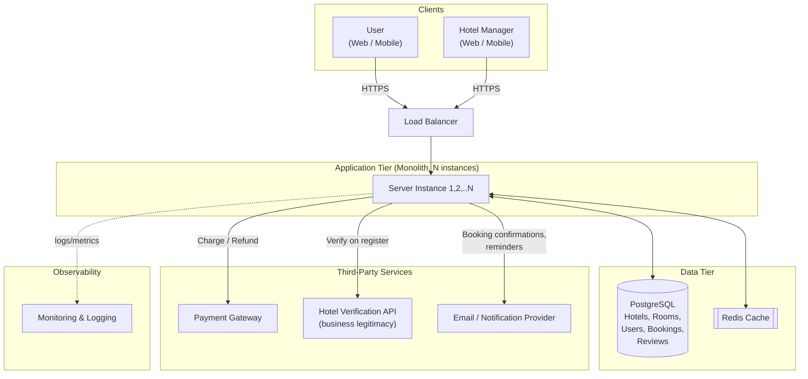

#### 5.1.3. Database ERD

```mermaid
erDiagram
    USER ||--|| INVOICE : pays
    HOTEL_MANAGER ||--|| HOTEL : manages
    HOTEL ||--|| ROOM : has
    HOTEL ||--|| REVIEW : receives
    ROOM ||--|| BOOKING : booked_in
    USER ||--|| BOOKING : makes
    BOOKING ||--|| INVOICE : has
    HOTEL ||--|| HOTEL_AMENITY : has
    AMENITY ||--|| HOTEL_AMENITY : belongs_to
    ROOM ||--|| ROOM_IMAGE : has
    ROOM ||--|| DYNAMIC_PRICING_RULE : has

    USER {
        int id PK
        string email UK
        string password_hash
        string name
        string phone
        timestamp created_at
    }

    HOTEL_MANAGER {
        int id PK
        string email UK
        string password_hash
        string name
        string business_credentials
        boolean verified
        timestamp created_at
    }

    HOTEL {
        int id PK
        int manager_id FK
        string name
        string description
        string location
        int stars
        string type
        timestamp created_at
    }

    AMENITY {
        int id PK
        string name UK
    }

    HOTEL_AMENITY {
        int hotel_id PK,FK
        int amenity_id PK,FK
    }

    ROOM {
        int id PK
        int hotel_id FK
        int room_type_id FK
        int start_price
        int max_price
        int total_count
        int dynamic_pricing_rule_id FK
        timestamp created_at
    }
    ROOM_TYPE {
        int id PK
        enum name { single, double, suite }
    }

    DYNAMIC_PRICING_RULE {
        int id PK
        enum rule_type { occupancy, seasonality, special_event }
        enum change_type { percentage, fixed_amount }
        decimal change_value
        int occupancy_threshold
        date start_date
        date end_date
        string event_name
    }

    ROOM_IMAGE {
        int id PK
        int room_id FK
        string url
    }

    BOOKING {
        int id PK
        int user_id FK
        int room_id FK
        date check_in
        date check_out
        ENUM status { pending, confirmed, cancelled, completed }
        decimal total_price
        timestamp created_at
    }

    INVOICE {
        int id PK
        int booking_id FK,UK
        string invoice_number UK
        decimal amount
        timestamp created_at
    }

    REVIEW {
        int id PK
        int user_id FK
        int hotel_id FK
        int rating
        string comment
        timestamp created_at
    }

    INVOICE {
        int id PK
        int booking_id FK,UK
        string invoice_number UK
        int booking_id FK
        decimal amount
        timestamp created_at
    }
```

#### 5.1.4. API Design
##### 5.1.4.1 User Side
1. POST `/api/users` - Register a new user account.
2. POST `/api/users/login` - Login to the user account.
3. GET `/api/hotels/search` - Search for hotels based on criteria.
4. GET `/api/hotels/{hotelId}` - View hotel details.
5. POST `/api/hotels/{hotelId}/bookings` - Make a booking.
6. GET `/api/users/{userId}/bookings` - View user bookings.
7. DELETE `/api/users/{userId}/bookings/{bookingId}` - Cancel a booking.
8. POST `/api/hotels/{hotelId}/reviews` - Leave a review for a hotel.
9. GET `/api/hotels/{hotelId}/reviews` - View reviews for a hotel.
10. GET `/api/users/{userId}/notifications` - View user notifications.

##### 5.1.4.2 Hotel Side
1. POST `/api/hotels` - Register a new hotel account.
2. POST `/api/hotels/login` - Login to the hotel account.
3. PUT `/api/hotels/{hotelId}` - Update hotel information.
4. DELETE `/api/hotels/{hotelId}` - Delete hotel account.
5. GET `/api/hotels/{hotelId}/bookings` - View bookings for a hotel.
6. POST `/api/hotels/{hotelId}/bookings/{bookingId}/confirm` - Confirm a booking.
7. GET `/api/hotels/{hotelId}/reports` - Generate reports on bookings and revenue.


### 5.2. Phase 2: Large Scale Design
1. Migrate to a microservices architecture, where different services handle specific functionalities. Services are:
    - Hotel Service: Manages hotel information and amenities.
    - Booking Service: Handles booking creation, updates, and cancellations.
    - Search Service: Manages hotel search functionality.
    - Review Service: Handles user reviews and ratings for hotels.
    - Notification Service: Manages sending notifications to users and hotel managers.
2. Add an API Gateway to route requests to appropriate services and handle cross-cutting concerns like authentication and rate limiting.
3. Use Elasticsearch for hotel search functionality to provide fuzzy search (where users can find hotels even with typos) and better performance.
4. Add a Cassandra database for storing completed bookings and reviews. Historical bookings can be accessed through one of both partition keys: user_id or hotel_id. Reviews can be accessed through hotel_id as partition key.
5. Implement asynchronous communication between services using a message broker (e.g., RabbitMQ or Kafka). Producers and consumers will be as follows:
    - Booking Service produces booking events (created, updated, canceled) that are consumed by the Notification Service to send relevant notifications.
    - Hotel Service produces hotel update events that are consumed by the Search Service to update the search index.
    - Review Service produces review events that are consumed by the Notification Service to notify the hotel manager when a new review is posted.
    - Booking Service produces booking events that are consumed by the Hotel Service to update room availability and search index (If room is fully booked, it should not appear in search results for the booked dates).
6. Add a caching layer (e.g., Redis) in front of the Search Service to cache popular search results and reduce latency for users.
7. Add a CDN to serve static assets like hotel images and reduce latency for users globally.

### 5.2.1. Diagram

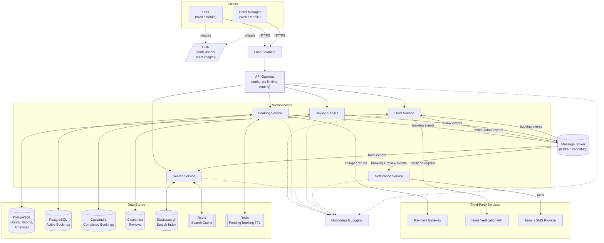

### 5.2.2. Services
#### 5.2.2.1. Hotel Service
1. Use a PostgreSQL database to store hotels, rooms, room types, amenities, dynamic pricing rules, and per-date availability. The data is highly relational (hotel→rooms, room→pricing rules, hotel→amenities) and inventory updates need ACID transactions, so a relational store is the right fit.
2. On hotel registration, call the third-party hotel verification API synchronously (HTTP) to confirm the manager's business credentials. Hotels stay in `pending_verification` status until the response returns and only `verified` hotels appear in search results — keeping this check synchronous gives the manager an immediate accept/reject signal at signup.
3. Store hotel and room images in S3 and serve them through a CDN. The service issues pre-signed URLs for upload and stores only object keys in the database, so the compute fleet stays stateless and image traffic never hits it.
4. Compute the effective price per room per date by applying the active dynamic pricing rules (occupancy %, seasonality date range, special events) on top of the base price. Rules are evaluated on read and the result is cached in Redis with a short TTL keyed by `(room_id, date)`; a rule update invalidates the affected keys. Rules change rarely, so caching the evaluated price absorbs the bulk of pricing reads.
5. Consume booking events from Kafka to update room availability — `booking.confirmed` decrements the available count for the date range, `booking.cancelled` and `booking.completed` adjust accordingly. The Hotel Service is the source of truth for "what's bookable when," and event-driven updates avoid synchronous coupling with the Booking Service.
6. Publish hotel events (`hotel.created`, `hotel.updated`, `hotel.deleted`, `room.updated`, `availability.changed`) to Kafka. The Search Service consumes these to keep Elasticsearch in sync — Hotel Service writes never block on Search availability.
7. Manager reports (bookings, revenue) are served via a service-to-service HTTP call to the Booking Service for small queries, and via a nightly export to a data warehouse for large aggregations. Reporting must never run on the live PostgreSQL.

##### API
1. `POST   /api/hotels` — register a hotel (triggers verification).
2. `POST   /api/hotels/login` — manager login.
3. `GET    /api/hotels/{hotelId}` — view hotel details (rooms, amenities, images).
4. `PUT    /api/hotels/{hotelId}` — update hotel info.
5. `DELETE /api/hotels/{hotelId}` — delete hotel.
6. `POST   /api/hotels/{hotelId}/rooms` — add a room.
7. `PUT    /api/hotels/{hotelId}/rooms/{roomId}` — update a room.
8. `DELETE /api/hotels/{hotelId}/rooms/{roomId}` — remove a room.
9. `POST   /api/hotels/{hotelId}/pricing-rules` — add a dynamic pricing rule.
10. `GET    /api/hotels/{hotelId}/availability?check_in=&check_out=` — room availability + computed price.
11. `POST   /api/hotels/images/presign` — pre-signed S3 URL for image upload.
12. `GET    /api/hotels/{hotelId}/reports?type=bookings|revenue&from=&to=` — manager reports.

##### Diagram

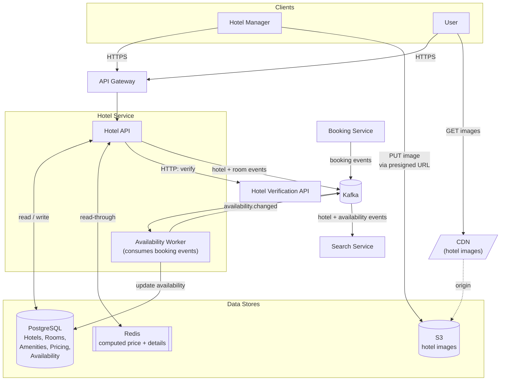

##### Database ERD

```mermaid
erDiagram
    HOTEL_MANAGER ||--o{ HOTEL : manages
    HOTEL ||--o{ ROOM : has
    HOTEL ||--o{ HOTEL_AMENITY : has
    AMENITY ||--o{ HOTEL_AMENITY : applied_to
    HOTEL ||--o{ HOTEL_IMAGE : has
    ROOM ||--o{ ROOM_IMAGE : has
    ROOM }o--|| ROOM_TYPE : is
    ROOM ||--o{ DYNAMIC_PRICING_RULE : has
    ROOM ||--o{ ROOM_AVAILABILITY : has

    HOTEL_MANAGER {
        int id PK
        string email UK
        string password_hash
        string name
        string business_credentials
        boolean verified
        timestamp created_at
    }

    HOTEL {
        int id PK
        int manager_id FK
        string name
        string description
        string location
        decimal latitude
        decimal longitude
        int stars
        enum type "hostel, motel, hotel, resort, apartment"
        enum status "pending_verification, verified, suspended"
        timestamp created_at
    }

    AMENITY {
        int id PK
        string name UK
    }

    HOTEL_AMENITY {
        int hotel_id PK_FK
        int amenity_id PK_FK
    }

    HOTEL_IMAGE {
        int id PK
        int hotel_id FK
        string s3_key
        int order_index
    }

    ROOM_TYPE {
        int id PK
        enum name "single, double, suite"
    }

    ROOM {
        int id PK
        int hotel_id FK
        int room_type_id FK
        decimal base_price
        int total_count
        timestamp created_at
    }

    ROOM_IMAGE {
        int id PK
        int room_id FK
        string s3_key
        int order_index
    }

    DYNAMIC_PRICING_RULE {
        int id PK
        int room_id FK
        enum rule_type "occupancy, seasonality, special_event"
        enum change_type "percentage, fixed_amount"
        decimal change_value
        int occupancy_threshold
        date start_date
        date end_date
        string event_name
        boolean active
    }

    ROOM_AVAILABILITY {
        int room_id PK_FK
        date date PK
        int available_count
        timestamp updated_at
    }
```

#### 5.2.2.2. Booking Service
1. Once a booking is initiated by the user, the Booking Service will create a booking record in the PostgreSQL database with status "pending". We can utilize Redis to set a TTL (Time To Live) and callbacks for the booking record, and if the booking is still in "pending" status after 5 minutes, a background worker can automatically update the status to "canceled". This ensures that we don't have stale pending bookings in our system and helps maintain accurate room availability.
    - If the payment is successful within 5 minutes: the status will be updated to "confirmed". Key will be deleted from Redis and the booking will be confirmed.
    - If payment fails: the booking will be automatically canceled and the status will be updated to "canceled". Key will be deleted from Redis and the booking will be canceled.
    - If the user does not complete the payment within 5 minutes: the booking will be automatically canceled and the status will be updated to "canceled".
    - If the user cancels the booking before payment: the status will be updated to "canceled" and the key will be deleted from Redis.
    - If the key expired the same time the payment is successful, we can overwrite the status to "confirmed" if the room is still available, otherwise we can update the status to "canceled" and notify the user that the room is no longer available, then proceed with a refund.
    
2. Use a PostgreSQL database to store active bookings, and a Cassandra database to store completed bookings for historical data and analytics. We can benefit from ACID transactions in PostgreSQL for consistency.
3. The Booking Service will produce booking events (created, updated, canceled) to a message broker (e.g., RabbitMQ or Kafka) that are consumed by the Notification Service to send relevant notifications to users and hotel managers. For example, when a booking is confirmed, the Booking Service will publish a "booking_confirmed" event with details of the booking, and the Notification Service will consume this event to send a confirmation email to the user and a notification to the hotel manager.
4. Charge and refund through a third-party Payment Gateway with idempotency keys derived from `booking_id`, so a retry on a flaky network never produces a duplicate charge. Payment attempts are recorded in their own table for auditability.
5. Enforce the 10-active-bookings-per-user constraint at write time and reject excess attempts with a clear error so that one user can't lock up large amounts of inventory.

##### API
1. `POST   /api/hotels/{hotelId}/bookings` — create a `pending` booking (body: room_id, check_in, check_out, guest_info).
2. `POST   /api/bookings/{bookingId}/payment` — initiate payment for a pending booking.
3. `GET    /api/users/{userId}/bookings` — list a user's bookings (active + historical merged).
4. `GET    /api/hotels/{hotelId}/bookings` — list a hotel's bookings (manager view).
5. `POST   /api/hotels/{hotelId}/bookings/{bookingId}/confirm` — manager confirmation (where required by hotel policy).
6. `DELETE /api/bookings/{bookingId}` — cancel a booking (refund applied per policy).
7. `GET    /api/bookings/{bookingId}` — view a single booking (used by Review Service for the eligibility check).

##### Diagram

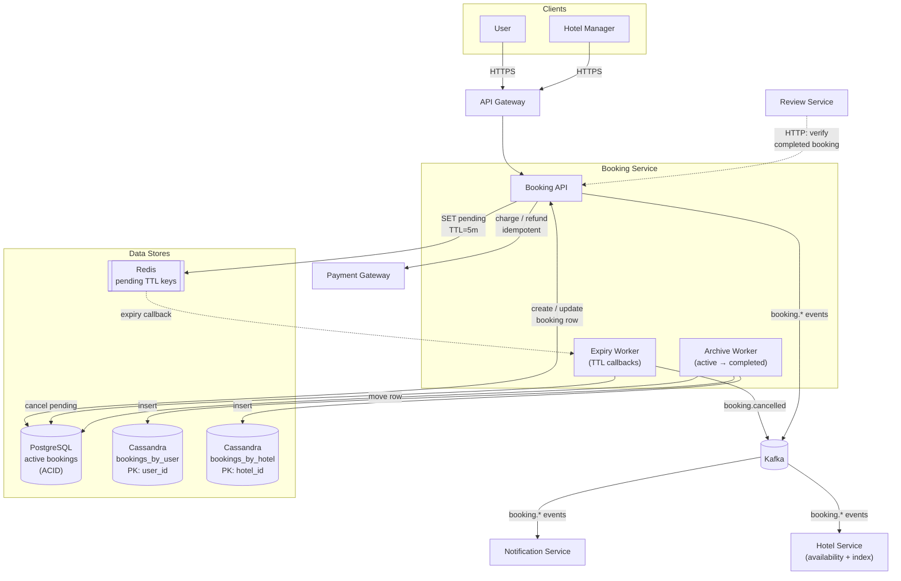

##### Database ERD

```mermaid
erDiagram
    BOOKING ||--|| INVOICE : has
    BOOKING ||--o{ PAYMENT_ATTEMPT : has

    BOOKING {
        int id PK
        int user_id
        int hotel_id
        int room_id
        date check_in
        date check_out
        enum status "pending, confirmed, cancelled, completed"
        decimal total_price
        string idempotency_key UK
        timestamp created_at
        timestamp updated_at
    }

    PAYMENT_ATTEMPT {
        int id PK
        int booking_id FK
        string gateway_charge_id
        decimal amount
        enum status "initiated, succeeded, failed, refunded"
        string failure_reason
        timestamp created_at
    }

    INVOICE {
        int id PK
        int booking_id FK_UK
        string invoice_number UK
        decimal amount
        timestamp created_at
    }

    BOOKINGS_BY_USER {
        int user_id PK "partition key"
        timestamp created_at PK "clustering key desc"
        int booking_id PK "clustering key"
        int hotel_id
        int room_id
        date check_in
        date check_out
        enum status
        decimal total_price
    }

    BOOKINGS_BY_HOTEL {
        int hotel_id PK "partition key"
        timestamp created_at PK "clustering key desc"
        int booking_id PK "clustering key"
        int user_id
        int room_id
        date check_in
        date check_out
        enum status
        decimal total_price
    }
```

#### 5.2.2.3. Search Service
1. Use Elasticsearch as the search index. Hotels are indexed as denormalized documents with name, description, location (geo_point), stars, type, amenities, base price, and per-date computed price + availability. Elasticsearch handles fuzzy matching, geo queries, faceted filtering, and sorting in a single query — relational stores cannot match this for hotel discovery at scale.
2. Index updates are driven by events, not direct writes. The Search Service consumes Kafka events: `hotel.*` (create/update/delete) from the Hotel Service to refresh the document, and `availability.changed` to update per-date inventory. Users cannot search or filter hotels by rating, so review events are not consumed and ratings stay out of the index.
3. Apply a Redis cache in front of Elasticsearch keyed by canonicalized query parameters (location + dates + filters). Most search traffic hits the same popular cities/dates; a short TTL (e.g., 60s) absorbs the bulk of the load and bounds cache staleness.
4. Search reads are anonymous and idempotent — no user state, no writes to Elasticsearch from the API path. This keeps the service horizontally scalable behind a load balancer with no consistency concerns.
5. Implement a bulk reindex job for schema migrations and disaster recovery — the Hotel Service can republish a full snapshot on demand and the Search Service rebuilds the index. The index is treated as derived data, not the source of truth, so it can always be rebuilt.
6. Apply a hard cap on result set size and require pagination via cursors. Deep pagination on Elasticsearch is expensive and rarely useful for hotel discovery — users either refine filters or move on.

##### API
1. `GET /api/hotels/search?location=&check_in=&check_out=&min_price=&max_price=&room_type=&amenities=&sort=price|distance|popularity&cursor=` — search hotels.
2. `GET /api/hotels/search/suggest?q=` — autocomplete on hotel name and city.

##### Diagram

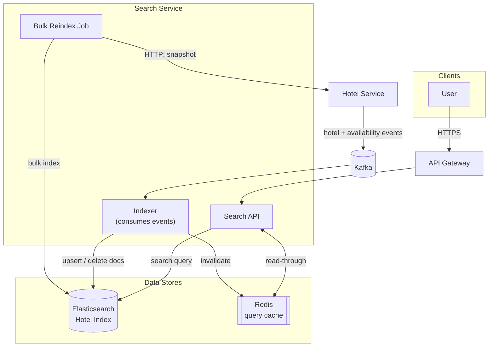

##### Database ERD

The Search Service does not own a relational schema; it owns an Elasticsearch document. The shape below shows the indexed fields (derived from Hotel Service events).

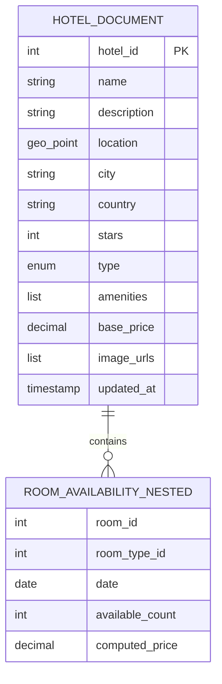

#### 5.2.2.4. Review Service
1. Use a Cassandra database to store reviews, with two tables: `reviews_by_hotel` (partitioned by `hotel_id`) and `reviews_by_user` (partitioned by `user_id`). This allows efficient querying of reviews by hotel and by user without cross-partition scans.
2. Use a Kafka topic for review events (e.g., `review.created`, `review.deleted`) that are consumed by a aggregation worker to maintain a separate `review_aggregates` table with average rating, count, and histogram for each hotel. Computing the average on read does not scale and synchronous updates would create hot-row contention on popular hotels; eventual consistency (a few seconds) is invisible in the rating UI. A nightly job recomputes from the raw rows to correct any drift.
3. Verify eligibility on submit with a synchronous HTTP API call to the Booking Service to confirm the user has a `completed` booking matching `booking_id`, and enforce one review per `(user_id, booking_id)` to prevent duplicates. The user is waiting on the response, so a rejection (no completed stay, or duplicate submit) must be immediate — an event-driven check is not appropriate here.
4. Handle review media via pre-signed S3 URLs — clients PUT image bytes directly to object storage and reads are served through a CDN. The service only stores object keys, stays stateless, and image traffic never hits the compute fleet.
5. Cache the hot path in Redis — first-page reviews per hotel and per-hotel aggregates with a short TTL (e.g., 60s) plus event-driven invalidation by the aggregation worker. The vast majority of reads are "first page of a popular hotel," so this absorbs most of the load. Writes do not block on cache; the next read repopulates.
6. Publish events to Kafka rather than calling downstream services directly. The Notification Service consumes `review.created` to notify the hotel manager when a new review is posted. Reviews and ratings are not pushed to the Search Service — users cannot search or filter hotels by rating, so the search index stays free of review data and the two services remain decoupled.
7. Make all writes idempotent — `booking_id` is a natural idempotency key so a flaky network can't create duplicate reviews. Event consumers (aggregation worker, notification consumer) are also idempotent because Kafka delivers at-least-once.

##### API
1. `POST   /api/hotels/{hotelId}/reviews` — submit a review (body: rating, text, image_keys[], booking_id).
2. `GET    /api/hotels/{hotelId}/reviews?cursor=&sort=recent|rating_desc|rating_asc` — cursor-paginated reviews for a hotel.
3. `GET    /api/hotels/{hotelId}/reviews/summary` — aggregates (avg, count, histogram).
4. `GET    /api/users/{userId}/reviews` — reviews authored by a user.
5. `DELETE /api/reviews/{reviewId}` — user deletes their own review (manager cannot).
6. `POST   /api/reviews/images/presign` — returns a pre-signed S3 URL for direct image upload.

##### Diagram

```mermaid
flowchart TB
    subgraph Clients["Clients"]
        User["User"]
        HotelManager["Hotel Manager"]
    end

    Gateway["API Gateway"]
    CDN[/"CDN<br/>(review images)"/]

    subgraph ReviewSvc["Review Service"]
        API["Review API<br/>(write + read)"]
        AggWorker["Aggregation Worker<br/>(rating rollups)"]
    end

    subgraph DataStores["Data Stores"]
        CassReviewsByHotel[("Cassandra<br/>reviews_by_hotel<br/>PK: hotel_id<br/>CK: created_at desc")]
        CassReviewsByUser[("Cassandra<br/>reviews_by_user<br/>PK: user_id<br/>CK: created_at desc")]
        CassAggregates[("Cassandra<br/>review_aggregates<br/>PK: hotel_id")]
        Cache[["Redis<br/>hot reviews + aggregates"]]
        ObjectStore[("S3<br/>review images")]
    end

    Broker[("Kafka")]
    BookingSvc["Booking Service<br/>(eligibility check)"]
    NotifSvc["Notification Service"]

    User -->|HTTPS| Gateway
    HotelManager -->|HTTPS| Gateway
    User -->|GET images| CDN
    User -->|PUT image<br/>via presigned URL| ObjectStore
    CDN -.origin.-> ObjectStore

    Gateway --> API

    API -->|HTTP: verify<br/>completed booking| BookingSvc
    API -->|write review| CassReviewsByHotel
    API -->|write mirror| CassReviewsByUser
    API <-->|read-through<br/>cache| Cache
    API -->|read reviews| CassReviewsByHotel
    API -->|read aggregates| CassAggregates

    API -->|review.created| Broker

    Broker --> AggWorker
    AggWorker -->|upsert avg, count,<br/>histogram| CassAggregates
    AggWorker -->|invalidate| Cache
    AggWorker -->|review.aggregate_updated| Broker

    Broker -->|review.created| NotifSvc
```

##### Database ERD

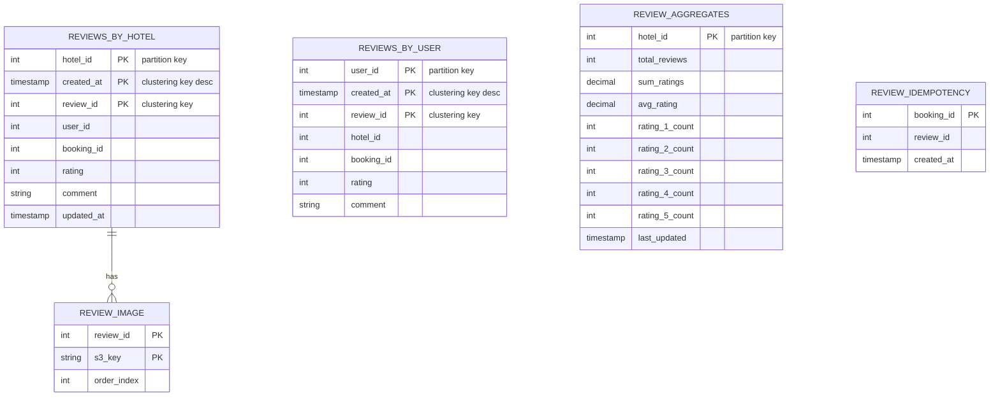

#### 5.2.2.5. Notification Service
1. Consume booking events (`booking.confirmed`, `booking.cancelled`, `booking.completed`) and review events (`review.created`) from Kafka. Each event type maps to a notification template (e.g., booking confirmation email, new review alert for the manager).
2. Send notifications through a third-party email/SMS provider (e.g., SendGrid, Twilio). The service is a thin orchestrator that picks the channel (email/SMS/push/in-app), renders the template, and submits to the provider — we don't run our own SMTP because deliverability is a hard problem better solved by specialists.
3. Store every notification attempt in PostgreSQL (`notification_log`) with status (`queued`, `sent`, `failed`, `bounced`, `read`) and provider message ID. This powers the in-app notifications view (`GET /api/users/{userId}/notifications`) and lets ops investigate delivery problems.
4. Schedule check-in reminders via a delayed-execution mechanism — when `booking.confirmed` arrives, schedule a reminder job for 24h before `check_in` using a delayed queue (e.g., Kafka delayed topics, or a separate scheduler with a job store). Don't schedule the reminder synchronously at booking time; the worker re-checks the booking status before sending so cancelled bookings don't trigger reminders.
5. Honor per-user preferences (email-only, opted-out channels, marketing toggle). Preferences are read from PostgreSQL once per notification and cached in Redis with a short TTL. An opted-out user produces an audit log entry but no provider call.
6. Make the consumer idempotent on `(event_id, recipient, channel)`. Kafka delivers at-least-once and the provider API is also at-least-once, so we deduplicate before sending — the same email never goes out twice.

##### API
1. `GET  /api/users/{userId}/notifications?cursor=` — list a user's notifications.
2. `POST /api/users/{userId}/notifications/{notifId}/read` — mark as read.
3. `PUT  /api/users/{userId}/notification-preferences` — update channel preferences.

##### Diagram

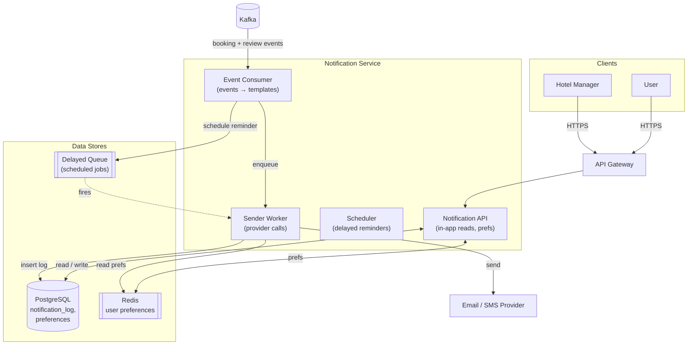

##### Database ERD

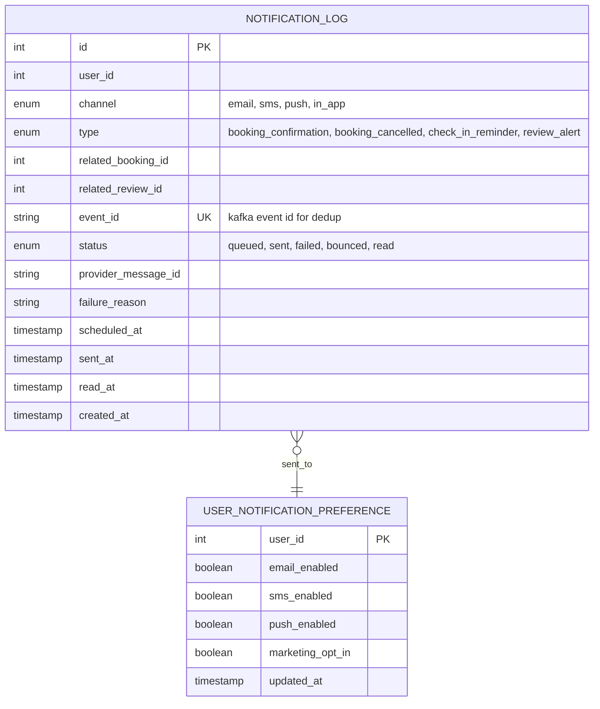

## 8. Technology Stack
1. **Backend services — Spring Boot 4 + reactive WebFlux (Java).** Most endpoints fan out to multiple downstream calls (Postgres + Redis + Kafka publish; Review Service calls Booking Service over HTTP; Hotel Service calls the verification API), so a non-blocking I/O model fits the topology much better than thread-per-request. WebFlux gives us back-pressure, low memory per connection, and clean composition of async work via `Mono` / `Flux`. Spring Boot 4's startup time and observability defaults make it a strong fit for containerized, autoscaled deployments.
2. **Reactive data drivers** — pair WebFlux with non-blocking drivers end-to-end: R2DBC for PostgreSQL, the DataStax reactive driver for Cassandra, Lettuce for Redis, Spring Kafka with reactive bindings, and the Spring `WebClient` for service-to-service HTTP calls. Avoid blocking JDBC paths in request handlers — they pin event-loop threads and defeat the reactive model.
3. **Relational store (PostgreSQL)** — Hotel Service (hotels, rooms, pricing, availability), Booking Service (active bookings, payment attempts, invoices), Notification Service (logs, preferences). Strong consistency and ACID transactions are non-negotiable for inventory and money.
4. **Wide-column store (Cassandra)** — high-throughput, time-ordered, partition-friendly data: completed bookings (`bookings_by_user`, `bookings_by_hotel`) and reviews (`reviews_by_hotel`, `reviews_by_user`, `review_aggregates`). Tables are denormalized per access pattern.
5. **Search index (Elasticsearch)** — hotel discovery: fuzzy matching, geo queries, faceted filters, and sort. Treated as derived data, rebuildable from Hotel Service.
6. **Cache (Redis)** — hot read paths in every service (computed pricing, search results, hotel details, review pages, user preferences) and the Booking Service's pending-booking TTL keys.
7. **Object storage (S3) + CDN** — hotel, room, and review images. Clients upload directly via pre-signed URLs; reads go through a CDN so image traffic never touches the compute fleet.
8. **Message broker (Kafka)** — asynchronous service-to-service communication. At-least-once delivery; consumers are designed to be idempotent.
9. **API Gateway** — auth (JWT validation), rate limiting, and routing to internal services. The single ingress point for external traffic.
10. **Authentication (JWT)** — tokens issued by the user and hotel manager auth flows, verified at the API Gateway.
11. **Payment** — third-party Payment Gateway, called only by the Booking Service, with idempotency keys derived from `booking_id`.
12. **Hotel verification** — third-party hotel verification API, called only by the Hotel Service during registration.
13. **Email / SMS** — third-party provider (e.g., SendGrid, Twilio), called only by the Notification Service.
14. **Observability** — centralized logs, metrics, and distributed traces across all services; per-service dashboards plus a cross-service request trace view. Spring Boot Actuator + Micrometer + OpenTelemetry feeds the pipeline.
15. **Deployment** — containerized services (Docker) on Kubernetes for autoscaling and rolling deploys, behind a regional load balancer with multi-AZ replication for the data stores.

## 9. Database Design

Each service owns its own data store and schema. There are no shared tables across services and no cross-service foreign-key constraints — referential integrity is enforced at the application/event layer.

##### Ownership Map

| Service | Store | Owned data |
|---|---|---|
| Hotel Service | PostgreSQL | `hotel`, `room`, `room_type`, `amenity`, `hotel_amenity`, `dynamic_pricing_rule`, `room_availability`, `hotel_image`, `room_image`, `hotel_manager` |
| Hotel Service | S3 + CDN | hotel and room image bytes |
| Hotel Service | Redis | computed pricing + hotel detail cache |
| Booking Service | PostgreSQL | `booking` (active), `payment_attempt`, `invoice` |
| Booking Service | Cassandra | `bookings_by_user`, `bookings_by_hotel` (completed) |
| Booking Service | Redis | pending-booking TTL keys |
| Search Service | Elasticsearch | `hotel_document` index (derived from Hotel Service events) |
| Search Service | Redis | query result cache |
| Review Service | Cassandra | `reviews_by_hotel`, `reviews_by_user`, `review_aggregates`, `review_image`, `review_idempotency` |
| Review Service | S3 + CDN | review image bytes |
| Review Service | Redis | hot reviews + aggregate cache |
| Notification Service | PostgreSQL | `notification_log`, `user_notification_preference` |
| Notification Service | Redis | user preferences cache |
| Notification Service | Delayed Queue | scheduled reminder jobs |

##### Cross-Service Rules

1. No service reads another service's tables directly. Cross-service data is exchanged via HTTP API (synchronous, when the caller is waiting on a result) or Kafka events (asynchronous, when the consumer can lag).
2. Search data is derived — the Elasticsearch index can always be rebuilt from the Hotel Service via a bulk reindex job.
3. Denormalized aggregates (review ratings, room availability) are maintained by event consumers and reconciled by periodic jobs to correct drift.
4. Identifiers (`user_id`, `hotel_id`, `room_id`, `booking_id`, `review_id`) are simple integer IDs that flow across services in events and API calls; there are no cross-database FK constraints.
5. Money and inventory live in PostgreSQL where ACID transactions apply. Read-mostly historical and opinion data lives in Cassandra. Search lives in Elasticsearch. Caches live in Redis. Each store is chosen to match its access pattern.

## 10. Summary

##### Approach

1. Phase 1 starts as a stateless Spring Boot monolith fronted by a load balancer, backed by PostgreSQL for everything and Redis for caching. This is enough for early traffic and lets us iterate on the domain model before paying microservice complexity costs.
2. Phase 2 splits the monolith along clear domain boundaries — Hotel, Booking, Search, Review, Notification — each owning its own data store. Services talk to each other via HTTP for synchronous needs and Kafka for asynchronous fan-out. An API Gateway is the single ingress point.
3. The data model is intentionally not unified: each store is chosen to match its access pattern. PostgreSQL for inventory and money, Cassandra for high-throughput time-series (completed bookings, reviews), Elasticsearch for discovery, Redis for hot caches, S3 + CDN for media.

##### Key Decisions per Service

1. **Hotel Service** owns hotels, rooms, amenities, dynamic pricing, and per-date availability in PostgreSQL. Verification is a synchronous HTTP call at registration. Availability is updated by consuming booking events. Hotel events flow to Search.
2. **Booking Service** owns the booking lifecycle (`pending` → `confirmed`/`cancelled` → `completed`) with PostgreSQL ACID for active rows and Cassandra for completed history. Pending bookings have a 5-minute Redis TTL with expiry callbacks to release inventory. Charges and refunds go through the Payment Gateway with `booking_id`-derived idempotency keys.
3. **Search Service** owns an Elasticsearch index that is purely derived from Hotel Service events — rebuildable on demand. Anonymous, idempotent reads with a Redis query cache. Reviews and ratings are intentionally not in the search index because users do not search by rating.
4. **Review Service** stores reviews in two Cassandra tables denormalized by access pattern (`reviews_by_hotel`, `reviews_by_user`) and maintains a separate `review_aggregates` table updated asynchronously by an aggregation worker on `review.created`/`review.deleted` events. Eligibility is checked by a synchronous HTTP call to the Booking Service. Images go through pre-signed S3 URLs and a CDN. There is no moderation pipeline.
5. **Notification Service** consumes booking and review events, picks a channel based on user preferences, renders a template, and submits to a third-party email/SMS provider. Reminders use a delayed queue with a status re-check before sending. Every attempt is logged for in-app history and ops visibility.

##### Key Trade-offs

1. **Strong consistency only where it matters (money + inventory).** Aggregates, search results, and review ratings are eventually consistent — staleness of a few seconds is invisible to users and lets us scale read paths.
2. **Event-driven over point-to-point.** Services publish to Kafka; consumers are idempotent. Downstream outages don't block upstream writes.
3. **Synchronous HTTP only for waiting users.** Hotel verification at signup and review-eligibility on submit are synchronous because the caller needs an immediate answer. Everything else is async.
4. **Derived data is always rebuildable.** The Search index, review aggregates, and room availability tables can all be reconstructed from authoritative stores — periodic reconciliation jobs correct drift.
5. **Reactive end-to-end.** Spring Boot 4 + WebFlux with non-blocking drivers (R2DBC, reactive Cassandra, Lettuce, reactive Kafka, `WebClient`) keeps thread usage low under the fan-out pattern that dominates this system.

##### Out of Scope (intentionally)

1. Review moderation pipeline.
2. Search by hotel rating.
3. Multi-currency pricing (USD only).
4. Pay-at-hotel (all bookings prepaid).
5. Multi-region active-active deployment (Phase 3 territory if needed).
