# URL Shortener (TinyURL / bit.ly) System Design

Design and implement a URL shortener service like TinyURL or bit.ly. The service should provide an API to shorten long URLs into short codes, redirect users from short codes to the original long URLs, and track analytics on URL usage.

---

## Architecture Diagrams

The diagrams below were generated programmatically with the Python [`diagrams`](https://diagrams.mingrammer.com/) library (script: [`diagrams/generate.py`](./diagrams/generate.py)). They complement the Mermaid sequence/flow diagrams embedded later in this document.

### System Overview
End-to-end view of every service, store, and queue in the URL shortener and how a request moves through them.

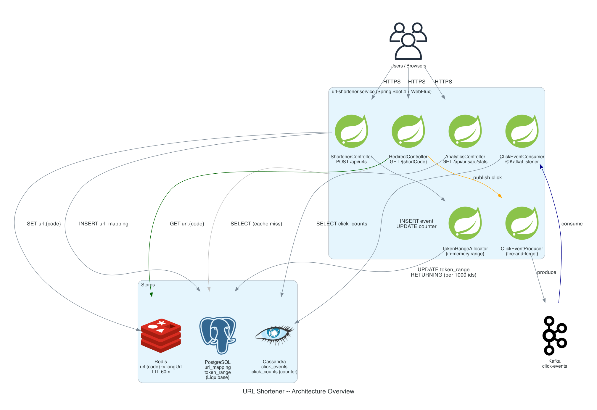

### Token Range Allocator
Counter-based ID generation: an in-memory `AtomicLong` hands out 1 000 IDs per DB round-trip; concurrent callers coalesce on a shared `Mono` so refresh happens at most once at a time.

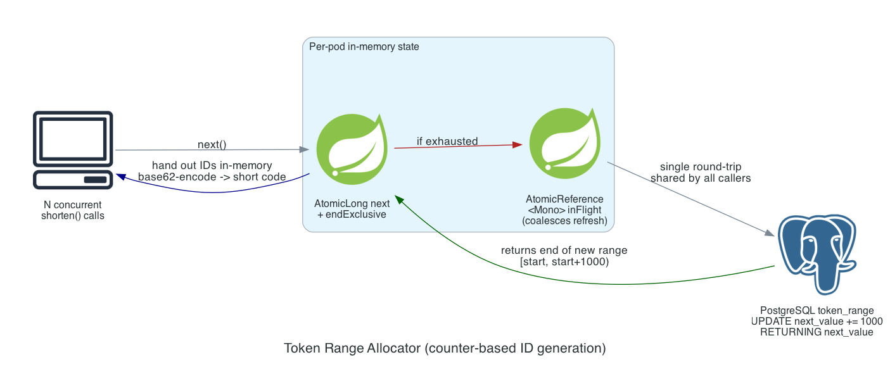

### Write Flow -- Shorten
What happens on `POST /api/urls`: allocate ID, base62-encode, persist to PostgreSQL, warm the Redis cache, return the short URL.

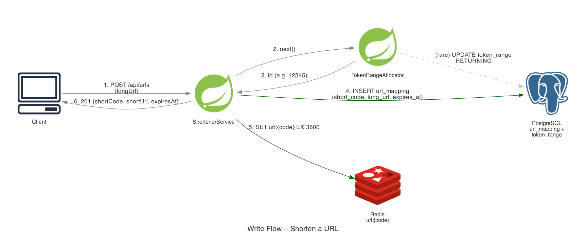

### Read Flow -- Redirect
Cache-aside read with fire-and-forget click event publish. Redirect latency depends only on Redis + PostgreSQL, never on Kafka health.

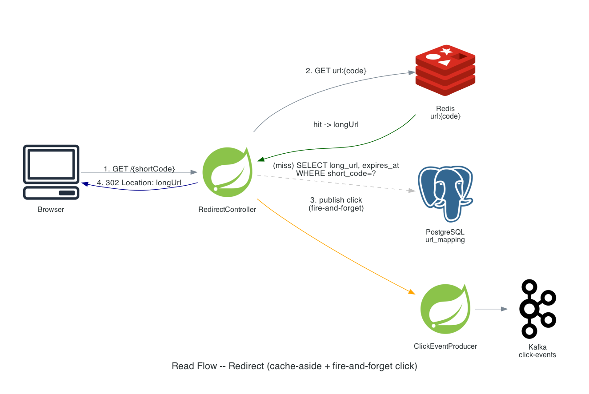

### Analytics Pipeline
Click events fan out from the redirect handler through Kafka into two Cassandra tables: a raw event log (`click_events`, partitioned by `short_code`) and a per-day counter aggregate (`click_counts`) read by the stats endpoint.

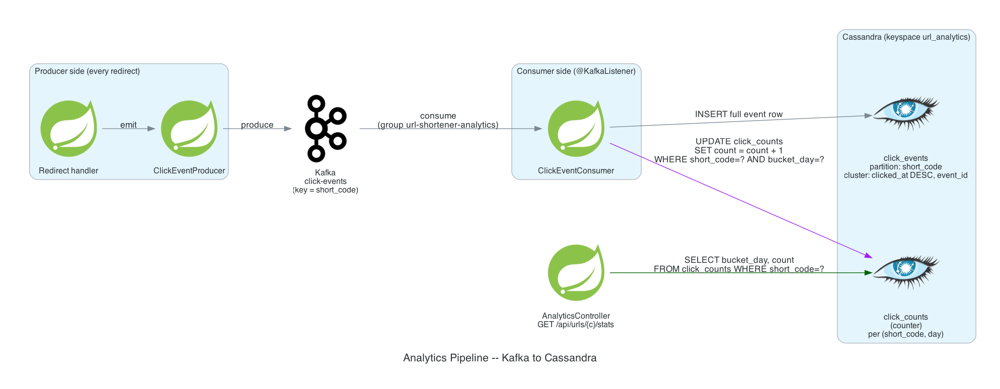

### Storage Layout
One store per access pattern: PostgreSQL for ACID writes, Redis for low-latency reads, Kafka for decoupling, Cassandra for write-heavy analytics.

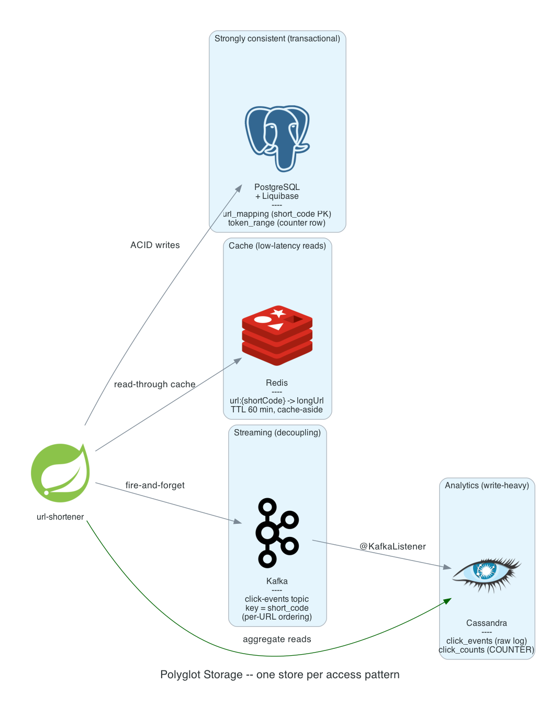

---

## 1. Overview and Questions to Clarify

Design a URL shortener like bit.ly. Given a long URL, generate a short URL; when the short URL is accessed, redirect to the original. Track analytics on clicks.

Clarifying questions to ask in an interview:

1. How many URLs per second do we shorten? How many redirections per second?
2. Are short codes case-sensitive? What character set?
3. How long is the short code? Fixed or variable length?
4. Do URLs expire? Configurable per URL or system-wide TTL?
5. Are duplicate long URLs collapsed to the same short URL or each gets its own?
6. Can users provide a custom short code (vanity URLs)?
7. Do we need user accounts? Anonymous shortening allowed?
8. What analytics do we need (counts only, or per-click metadata: geo, UA, referrer)?
9. SLAs -- p99 latency for redirect? Read/write availability targets?
10. Do we need to support deletion / reporting / abuse takedown?
11. Geographic distribution -- single region or multi-region active-active?

---

## 2. Functional Requirements

### 2.1. Shortening Side

1. `POST /api/urls` accepts a long URL and returns a 6-character short code plus the full short URL and an expiry timestamp.
2. Each shorten request must produce a globally unique short code -- duplicate long URLs are NOT collapsed (each call returns a new code; matches bit.ly's behavior).
3. Short URLs expire after a configurable TTL (default 1 year). Expired URLs return 404 on redirect.
4. `GET /api/urls/{shortCode}` returns metadata for inspection: long URL, creation timestamp, expiry, creator IP.

### 2.2. Redirect & Analytics Side

1. `GET /{shortCode}` returns HTTP 302 with the `Location` header set to the original long URL. 404 if the code doesn't exist or has expired.
2. Every redirect emits an asynchronous click event (timestamp, IP, user-agent, referrer) into the analytics pipeline.
3. `GET /api/urls/{shortCode}/stats` returns aggregated click counts: total clicks plus per-day breakdown.
4. Out of scope for this implementation: vanity URLs, user accounts, multi-region replication, abuse / safety scanning.

---

## 3. Non-Functional Requirements

1. **Latency**: p99 redirect < 50 ms on cache hit, < 200 ms on cache miss. Shorten p99 < 200 ms.
2. **Availability**: 99.9 % for the redirect path. Shortening can degrade independently (lower availability acceptable for the write path).
3. **Throughput target**: 50 shortens/sec, 1 000 redirects/sec. That's ~4.3 M URLs/day and ~86 M redirects/day.
4. **Scalability**: app servers must scale horizontally; storage must absorb both write throughput (analytics) and read throughput (redirects) without becoming a bottleneck.
5. **Read-heavy**: redirect:shorten ratio ~ 20:1. Optimize the read path first.

---

## 4. Constraints

1. **Short code length 6**, alphabet of 62 chars (`0-9 a-z A-Z`) → 62⁶ ≈ 56.8 billion combinations. At 50 URLs/s that's ~36 thousand years of headroom; length 7 gives 3.5 trillion.
2. **Storage budget**: 4.3 M URLs/day × ~500 B = ~2 GB/day URL state. Click events ~100 B × 86 M = ~8 GB/day. Over 1 year: ~750 GB URL mappings + ~3 TB click events.
3. **Range allocator**: 1 000 IDs per fetch → DB write rate from token allocation is ~50/1000 = 0.05 writes/s, effectively zero.
4. **Single short code per long URL is NOT a constraint**: we explicitly accept duplicates.

---

## 5. Design Phases

### 5.1. Phase 1: Simple Scale Design

A single instance proof-of-concept that handles modest load. Uses one SQL DB row as a counter, Redis as a hot cache, and synchronous in-process click logging.

#### 5.1.1. Design Decisions

- **Single monolithic service** owns shorten, redirect, and stats endpoints.
- **One PostgreSQL row as a counter**: every shorten does `UPDATE token_range SET next_value = next_value + 1 RETURNING next_value`. Cheap at this scale; one DB write per shorten.
- **Base62 encode the counter** to a 6-char short code.
- **Redis cache** for `url:{shortCode} -> longUrl`, 60-min TTL, cache-aside on the redirect path.
- **Click events**: log directly to a `click_events` table in PostgreSQL inside the redirect handler. Synchronous, simple, and good enough for this load.

### 5.1.2. Diagram

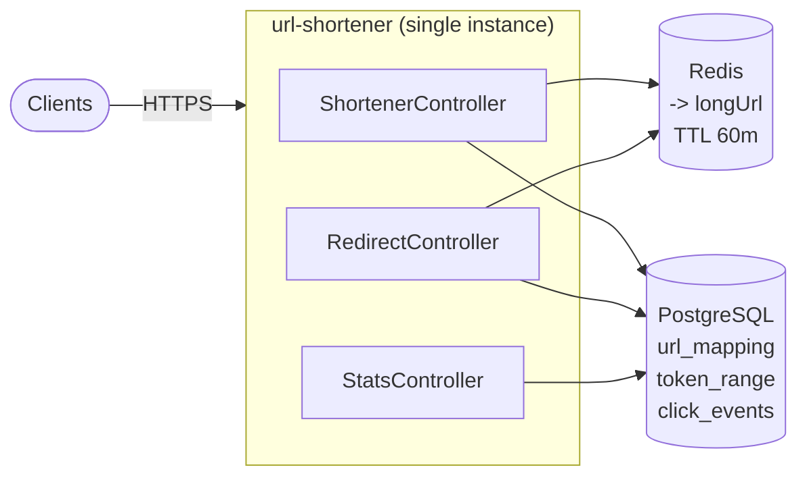

#### 5.1.3. Database ERD

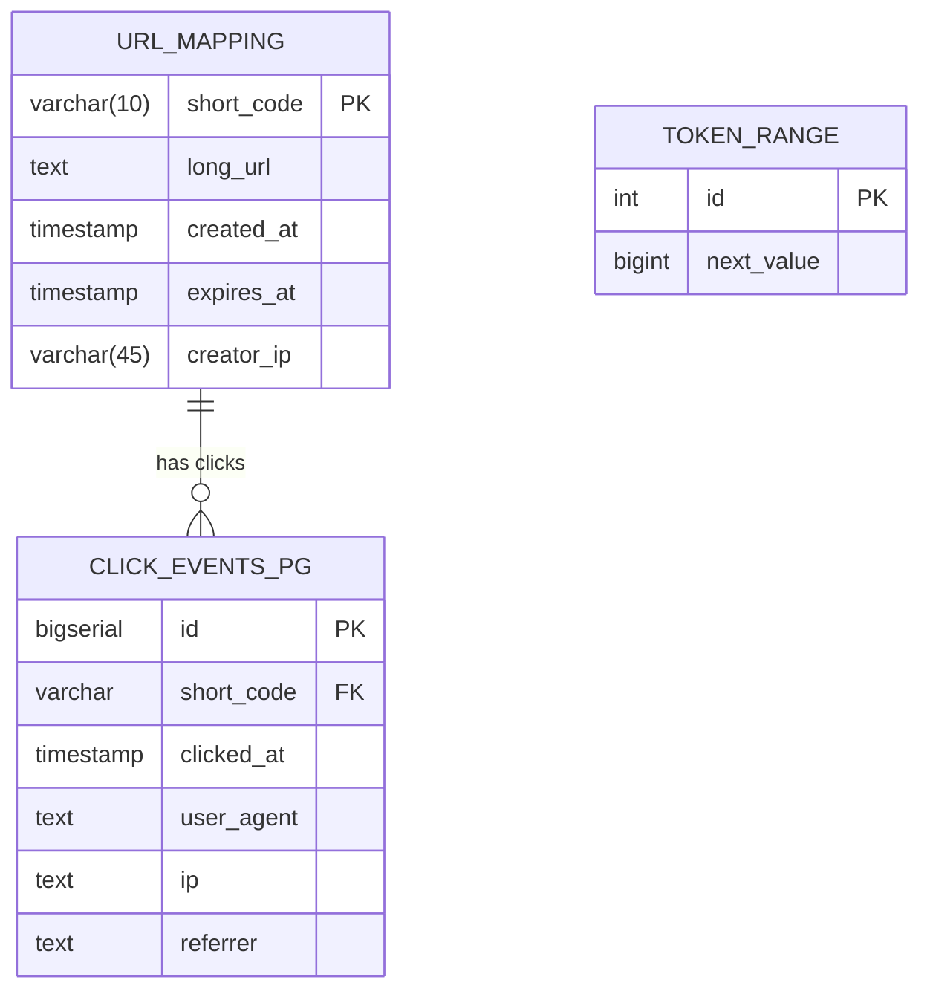

#### 5.1.4. API Design

| Method | Path | Body / Query | Response |
|--------|------|---|---|
| POST | `/api/urls` | `{ "longUrl": "https://...", "ttlHours": 8760 }` | `201 { "shortCode": "WG", "shortUrl": "http://localhost:8090/WG", "longUrl": "...", "createdAt": "...", "expiresAt": "..." }` |
| GET | `/{shortCode}` | -- | `302` + `Location: <long URL>`, or `404` |
| GET | `/api/urls/{shortCode}` | -- | `200 { "shortCode", "longUrl", "createdAt", "expiresAt", "creatorIp" }` |
| GET | `/api/urls/{shortCode}/stats` | -- | `200 { "shortCode", "totalClicks", "dailyCounts": [...] }` |

### 5.2. Phase 2: Large Scale Design

The Phase 1 design hits limits as load grows past a few hundred ops/sec:
1. The single-row counter becomes a serialization point; every shorten contends on the same row.
2. Logging click events synchronously couples redirect latency to DB write latency.
3. PostgreSQL is the wrong store for write-heavy analytics rows.
4. A single instance is a SPOF.

Phase 2 fixes all of these with horizontal scaling + dedicated stores per access pattern.

### 5.2.1. Diagram

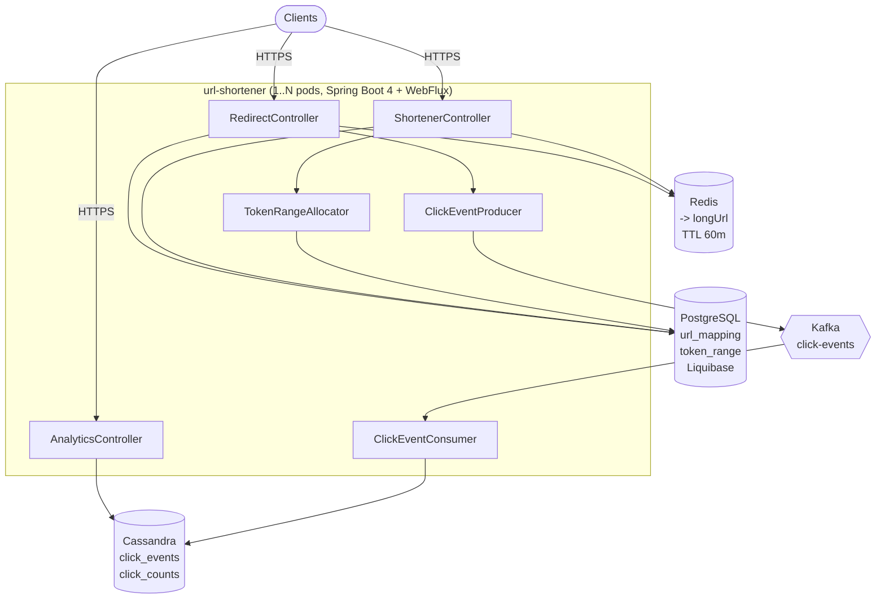

Why these choices:
- **PostgreSQL + Liquibase** for `url_mapping` and `token_range`: relational, ACID, perfect for the small range-allocator counter. Liquibase tracks schema changes.
- **Cassandra** for click events: write-heavy append-only; partitioned by `short_code` so reading "all clicks for one URL" is a single-partition scan.
- **Kafka** for click events: decouples the redirect hot path from analytics writes. A redirect succeeds even if Cassandra is degraded.
- **Redis** for the read cache: most redirect traffic concentrates on a small set of "hot" URLs. 60-minute TTL with cache-aside pattern.

### 5.2.2. Services

#### 5.2.2.1. Token Range Allocator

Phase 1's "increment by 1" pattern doesn't scale: every shorten does a serialized DB UPDATE. Each app instance reserves a **batch of 1 000 IDs** in one DB round-trip, hands them out from memory, then refreshes when exhausted.

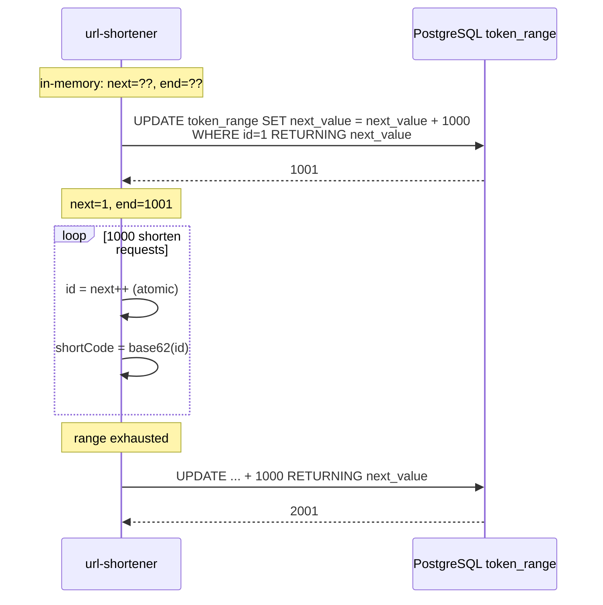

- One DB write every 1 000 shortens → effectively free at this scale.
- Multiple pods can run concurrently; they get non-overlapping ranges from the atomic UPDATE-RETURNING.
- Concurrent `next()` callers on the same pod coalesce on a shared in-flight `Mono` -- only one DB round-trip happens per refresh.
- A pod that crashes mid-range loses up to 999 numbers. Acceptable; we don't track gaps.
- Base62 encoding (`0-9 a-z A-Z`) maps integer → 6-char string.

#### 5.2.2.2. Shortener Service (write flow)

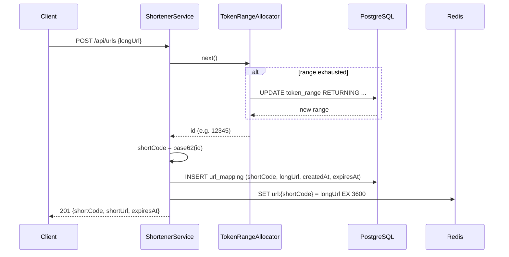

- The Redis SET on write is **proactive cache warming** -- a fresh shorten is likely to be hit within seconds (e.g., user copy-pasting and clicking).
- `INSERT url_mapping` uses an explicit `Persistable<String>` flag because the PK is manually assigned -- without it, Spring Data R2DBC's `save()` does a no-op UPDATE on a row that doesn't exist yet.

#### 5.2.2.3. Redirect Service (read flow)

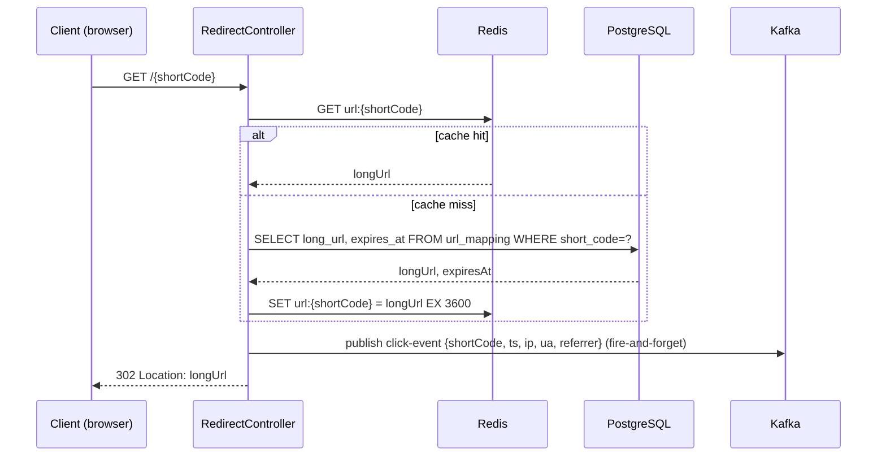

- The Kafka publish is **non-blocking and any error is swallowed** -- redirect latency depends only on cache + DB, never on Kafka health. This is intentional: a Kafka outage degrades analytics but never the user-visible redirect.
- Cache-aside (lazy) population keeps the cache aligned with actual demand -- only URLs that are clicked stay warm.

#### 5.2.2.4. Click Event Pipeline

The analytics pipeline is the main reason Phase 2 introduces Kafka and Cassandra. Click events have very different access patterns than URL mappings (write-heavy, append-only, time-series-shaped) so they go in their own pipeline + store.

```mermaid
flowchart LR
  subgraph App["url-shortener (1..N pods)"]
    Redirect[Redirect handler]
    ClickProducer[ClickEventProducer]
    Consumer[ClickEventConsumer<br/>@KafkaListener]
  end
  Redirect -->|fire-and-forget| ClickProducer
  ClickProducer -->|publish| Kafka{{Kafka<br/>click-events}}
  Kafka -->|consume| Consumer
  Consumer -->|INSERT| ClickEvents[(Cassandra<br/>click_events<br/>partitioned by short_code)]
  Consumer -->|UPDATE counter| ClickCounts[(Cassandra<br/>click_counts<br/>per short_code, day)]
```

Two Cassandra tables, each tuned for a specific query:
- **`click_events`**: full event row, partitioned by `short_code`, clustered by `clicked_at DESC`. Fast read of "last N clicks for URL X".
- **`click_counts`**: Cassandra COUNTER table, one row per `(short_code, day)`. O(1) read for "total clicks per day for X". Avoids scanning all events for aggregate queries.

`GET /api/urls/{shortCode}/stats` reads `click_counts` only -- aggregate reads never touch the raw event log.

The consumer must be idempotent because Kafka delivery is at-least-once: `INSERT` to `click_events` includes a `event_id UUID` in the clustering key (so a re-consumed event with the same UUID overwrites itself), and the counter `UPDATE` is non-idempotent in principle but tolerable for analytics where small over-counts under crash + replay are acceptable.

---

## 8. Technology Stack

- **Java 21** + **Spring Boot 4.0.6** + **Spring WebFlux** (reactive, non-blocking)
- **Spring Data R2DBC** + `org.postgresql:r2dbc-postgresql` for PostgreSQL (`url_mapping`, `token_range`)
- **Spring Data Cassandra Reactive** for `click_events` and `click_counts`
- **Spring Kafka 4.0.0** -- manually configured (Spring Boot 4 ships no Kafka auto-config)
- **Spring Data Redis Reactive** (Lettuce) for the URL cache
- **Liquibase** for SQL schema migrations
- **Apache Kafka KRaft mode** (`apache/kafka-native:3.9.0`)
- **Apache Cassandra 4.1**
- **Redis 7**
- **PostgreSQL 16**
- **Docker Compose** for local infra
- Build: **Maven**
- Docs: **springdoc-openapi** + Swagger UI

See [`../code/README.md`](../code/README.md) for build / run instructions and a full curl flow.

---

## 9. Database Design

### 9.1. PostgreSQL (Liquibase-managed)

```sql
CREATE TABLE url_mapping (
    short_code  VARCHAR(10) PRIMARY KEY,
    long_url    TEXT        NOT NULL,
    created_at  TIMESTAMP   NOT NULL DEFAULT NOW(),
    expires_at  TIMESTAMP   NOT NULL,
    creator_ip  VARCHAR(45)
);

CREATE INDEX url_mapping_expires_idx ON url_mapping (expires_at);

CREATE TABLE token_range (
    id          INT     PRIMARY KEY,
    next_value  BIGINT  NOT NULL
);
INSERT INTO token_range (id, next_value) VALUES (1, 1000);
```

- `url_mapping` PK is the short code -- O(1) lookup on the redirect path.
- `expires_at` index supports a periodic sweep job that hard-deletes expired rows.
- `token_range` is a single row; the `id INT PK = 1` constraint guards against accidental multi-row state.

### 9.2. Cassandra

```cql
CREATE KEYSPACE url_analytics
WITH replication = {'class':'SimpleStrategy','replication_factor':1};

CREATE TABLE click_events (
    short_code  TEXT,
    clicked_at  TIMESTAMP,
    event_id    UUID,
    user_agent  TEXT,
    ip          TEXT,
    referrer    TEXT,
    country     TEXT,
    PRIMARY KEY ((short_code), clicked_at, event_id)
) WITH CLUSTERING ORDER BY (clicked_at DESC, event_id ASC);

CREATE TABLE click_counts (
    short_code  TEXT,
    bucket_day  TEXT,    -- 'YYYY-MM-DD'
    count       COUNTER,
    PRIMARY KEY ((short_code), bucket_day)
);
```

- `click_events` partition key is `short_code` -- "all clicks for URL X" is a single-partition read.
- Clustering by `clicked_at DESC` gives "most recent N clicks" for free without an order-by sort.
- `event_id UUID` is the tiebreaker in the clustering key so two clicks at the same millisecond don't collide.
- `click_counts` is a Cassandra COUNTER table -- one row per `(short_code, day)`, updated with `UPDATE click_counts SET count = count + 1`. O(1) read for daily totals.

---

## 10. Summary

The URL shortener is intentionally a small system that demonstrates several patterns common to high-scale CRUD services:

- **Polyglot persistence**: PostgreSQL for transactional writes (the source of truth + counter), Redis for low-latency reads, Cassandra for write-heavy analytics, Kafka for decoupling. Each store is sized and shaped for its workload.
- **Counter-based ID generation with range allocation**: trades a small chance of gaps for ~1000× fewer DB writes than a naive `UPDATE ... + 1` approach.
- **Cache-aside reads**: the cache is populated on miss and proactively on write, but reads always go through the cache first; the source of truth remains PostgreSQL.
- **Async analytics via Kafka**: the redirect hot path stays on the budget (cache + DB) and is unaffected by analytics-pipeline outages. The consumer is idempotent so at-least-once delivery is safe.
- **Aggregate denormalization in Cassandra**: a separate counter table avoids scanning the raw event log to answer "how many clicks today for X".

Trade-offs explicitly accepted (out of scope for this implementation):
- **No long-URL deduplication.** Each shorten produces a new code. Adding dedup is a unique index + `INSERT ON CONFLICT RETURNING short_code`.
- **Range allocator loses ~999 numbers** per pod crash. No gap tracking.
- **Single Kafka partition** for `click-events`. For >100 K events/s split into N partitions, key by `short_code` so per-URL events stay ordered.
- **No multi-region.** Cassandra and PG are single-DC. To add: `NetworkTopologyStrategy` for Cassandra; managed PG with read replicas for PG.
- **No rate limiting** at the app layer. Add at the gateway (Spring Cloud Gateway's `RequestRateLimiter`).
- **Click events fire-and-forget.** A Kafka outage drops events silently. For audit-grade analytics use the transactional outbox pattern.
- **No abuse handling** (malware/phishing detection, takedown API). In production, hook a URL safety check (Google Safe Browsing) before shortening.

The implementation in [`../code/`](../code/) follows the Phase 2 design directly. Phase 1 is documented here as a teaching reference for what the simpler version looks like before scaling pressure forces the additional moving parts.
